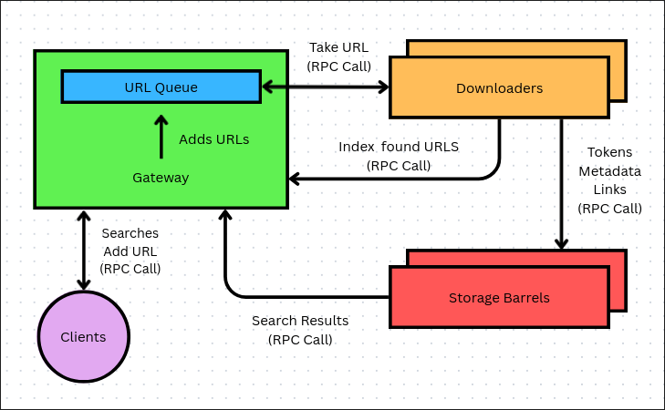

# Distributed Search Engine (Googol)
Googol is a distributed search engine where components communicate through RPC calls. It works through a simple web frontend or CLI that lets the user index new URLs and perform searches.

## How it's built
There are five main components in the system's backend:


### URL Queue
The URL Queue is a data structure that tracks URLs waiting to be indexed. It's implemented inside the Gateway, so both Clients and Downloaders can add URLs through the same RPC endpoint. Clients use it when submitting a URL manually, and Downloaders when they discover new links while crawling the web pages.


### Gateway
The Gateway exposes the URL Queue via two RPC methods: `putNew()`, used by both Clients and Downloaders to add a URL to be indexed, and `takeNext()`, used by the Downloaders to pull the next URL to crawl. It also serves as the entry point for the clients, `search()` returns ranked results for a set of search terms, and `getIncomingLinks()` returns pages linking to a given URL.

### Client
The Client is the program a user interacts with directly and it invokes RPC calls on the Gateway. Users can index new URLs, perform searches, look through the results with pagination and look up which pages link to a given result.

### Downloaders
Downloaders handle web crawling. Each Downloader takes a new URL from the Queue using `takeNext()`, downloads, parses and tokenizes its text, keeping only words with 3 or more characters. Each word is sent to every Storage Barrel via `addToIndex()` adding it to the inverted index alongside the URL. Title and text snippet are then sent separately via `addPageMeta()`. New URLs found are sent back to the Gateway to be queued for crawling, up to a maximum depth. Each link is also sent to the Storage Barrels with `addLinkTracking()` which saves it to a link dictionary that keeps track of incoming links between pages.

### Storage Barrels
Barrels act as the system's storage and handle search requests from the Gateway. They receive data from the Downloaders and index it into their data structures. Each Barrel saves its data to disk using `pickle`, avoiding data loss if it goes down. When a restart occurs, each Barrel tries to reload its own files.
Barrels expose three RPC methods used by the Downloaders and two for the Gateway, as mentioned in each of these components descriptions.
When the Gateway calls `search()`, the Barrel returns results ranked by number of incoming links, and metadata (title and text preview) for each result. Search results are paginated server-side, the caller specifies a page and page size, and the Barrel returns only that slice along with the total result count.

## Frontend
There is an alternative to the CLI Client implemented using a FastAPI application and Jinja2 to render pages for indexing URLs, searching and viewing incoming links for a result. `rpc_client.py` functions like a bridge between web routes and the Gateway, wrapping each RPC call (`putNew()`, `search()`, `getIncomingLinks()`) so that `routes.py` doesn't call gRPC directly.

### Routes
| Route     | Method     | Purpose                                 |
|-----------|------------|-----------------------------------------|
| `/`       | GET        | Home page                               |
| `/search` | GET / POST | Search page / run a search              |
| `/index`  | GET / POST | Indexing page / submit a URL            |
| `/links`  | POST       | Show pages linking to a given URL       |

### AI Overview
On the first page of a search, an AI-generated summary of the search terms is shown above the results. For this I used a local AI model, specifically `tinyllama` through Ollama's HTTP API. The summary is only generated on the first page to avoid redundant calls when paging through results.

## How to run

> Developed and tested on Linux, steps may vary on other OS.

### Setup
1. Clone the repo.
2. Install Python dependencies, a virtual environment is recommended: `pip install -r requirements.txt`
3. Generate the gRPC code from the `.proto` file: run `protos/generate-gRPC-code.sh`
4. Update IPs as needed (see table below), all default to `localhost`. Ports are also hardcoded, except for the Barrels.
5. Install Ollama and pull the model used for AI summaries:
```bash
curl -fsSL https://ollama.com/install.sh | sh
ollama pull tinyllama
# Or bring your own model, just update the name in routes.py
```
The model will then be ready to receive requests at `localhost:11434`.

### Running
Start the components in this order (works the same whether testing on one machine or two, as long as IPs are configured correctly):

**Storage Barrels**
```bash
python storage_barrel.py <barrel_name> <port>
# e.g.
python storage_barrel.py barrel1 8184
python storage_barrel.py barrel2 8185
```

**Gateway**
```bash
python gateway.py
```

**Downloader**
```bash
python downloader.py
```

**CLI Client**
```bash
python client.py
```

**Web Frontend**
```bash
uvicorn app.main:app --reload --port 8080
```

### Hardcoded IP locations
| File                | Line | Purpose                             |
|---------------------|-----|--------------------------------------|
| `gateway.py`        | 10  | Storage Barrel 1 IP                  |
| `gateway.py`        | 11  | Storage Barrel 2 IP                  |
| `gateway.py`        | 12  | Gateway IP                           |
| `storage_barrel.py` | 166 | IP of the machine running the Barrel |
| `downloader.py`     | 36  | Gateway IP                           |
| `downloader.py`     | 37  | Storage Barrel 1 IP                  |
| `downloader.py`     | 38  | Storage Barrel 2 IP                  |
| `client.py`         | 6   | Gateway IP                           |

## Known Limitations
- **Hardcoded addresses.** IPs and most ports are hardcoded instead of using, for example, configuration files or run parameters.
- **Fixed number of replicas.** The system was built and tested with exactly 2 Storage Barrels, in its current state, the project isn't ready for scalability and would need some tweaks in the components code.
- **Read endpoints use POST.** `/search` and `/links` are implemented as POST routes even though they don't modify server state.

---
*Originally built as a university assignment for a Distributed Systems course.*
